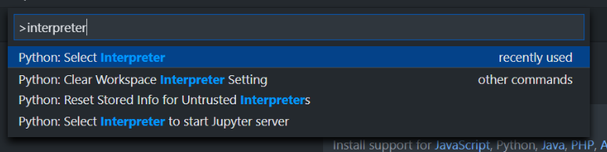
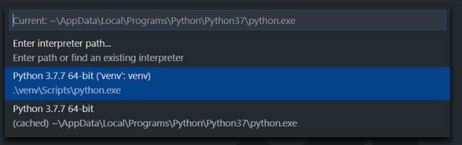
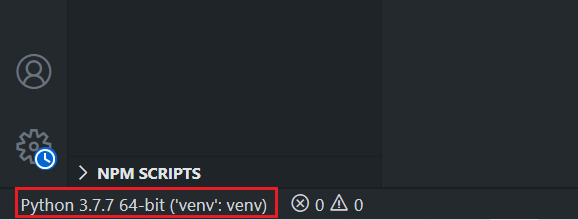
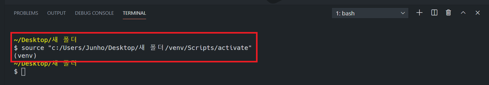

[toc]

# Virtual Environment

## 가상 환경

> 파이썬 인터프리터, 라이브러리, 및 스크립트가 "시스템 파이썬" (즉, 운영 체제 일부로 설치되어 있는 것)에 설치된 모든 라이브러리와 격리 되러있는 파이썬 환경
>
> https://docs.python.org/ko/3.7/library/venv.html
>
> [https://docs.python.org/ko/3.7/library/venv.html#module-venv](https://docs.python.org/ko/3.7/library/venv.html)
>
> https://docs.python.org/ko/3.7/library/venv.html#venv-def

- 각 가상 환경을 고유한 파이썬 환경을 가지며 독립적으로 설치된 패키지 집합을 가짐


**왜 사용하는가?**

- pip로 설치한 패키지들은 Lib/site-packages안에 저장되는데 이는 모든 파이썬 스크립트에서 사용할 수 있다.

- 그런데 여러 프로젝트를 진행하게 되면 프로젝트 마다 다른 버전의 라이브러리가 필요할 수도 있는데 파이썬에서는 한 라이브러리에 대해 하나의 버전만 설치가 가능하다.

- 더불어 각 라이브러리나 모듈은 서로에 대한 의존성(dependency)이 다르기 때문에 알 수 없는 충돌이 발생하거나 다른 여러 문제를 일으킬 수 있게 된다.
- 파이썬의 경우도 같은 파이썬 버전, 똑같은 모듈 버전을 쓴다는 보장이 없다.


**가상 환경 지원 모듈**

- `venv` : Python 3.3 버전 이후 부터 기본모듈에 포함됨. **공식문서 권장사항**
- `virtualenv` : Python 2 버전부터 사용해오던 가상환경 라이브러리, Python 3에서도 사용가능
- `conda` : Anaconda Python을 설치했을 시 사용할 수있는 모듈
- `pyenv` : pyenv의 경우 Python Version Manger임과 동시에 가상환경 기능을 플러그인 형태로 제공 (macOS)


---


## VENV

> Git Bash 에서 동작하게 하려면, python 버전 3.7.2 이상이 필요
>
> https://docs.python.org/3/library/venv.html


**생성 및 활성화**

```bash
$ python -m venv [가상환경이름]
$ source [가상환경이름]/Scripts/activate

(가상환경이름)
$
```


**운영체제별 활성화**

- Git Bash

  ```bash
  $ source [가상환경이름]\Scripts\activate
  ```

- CMD

  ```bash
  $ source [가상환경이름]\Scripts\activate.bat
  ```

- PowerShell

  ```bash
  $ source [가상환경이름]\Scripts\Activate.ps1
  ```

- macOS

  ```bash
  $ source [가상환경이름]/bin/activate
  ```

**비활성화**

```bash
$ deactivate
```

**pip 를 통해 현재 가상환경인지 항상 확인**

```bash
$ pip list 
```


**주의사항**

- 가상 환경을 만들고 나서 폴더(디렉터리)를 다른 곳으로 이동시키면 활성화가 안 된다. 
- 가상 환경을 활성화하는 activate.bat, Activate.ps1, activate 파일 안에 현재 가상 환경 폴더의 경로가 내장되어 있기 때문이다.


---


## pip freeze (패키지 관리)

> - 개발 환경이 바뀌었을 때 일일이 패키지를 설치해줘야 하거나, 협업을 하게 됐을 때 개발 중인 환경을 온전히 넘겨 줘야 할 때가 있다.
> - 이를 위해 개발 했던 환경을 기록하고 이를 새로운 환경 속에 한번에 이식할 수 있는 방법이 존재한다.
>
> https://pip.pypa.io/en/stable/reference/pip_freeze/


**pip freeze**

- 현재 환경에 설치된 패키지를 requirements format으로 출력

- 각 패키지들은 대소문자를 구분하지 않는 순서로 나열


**패키지 요구사항 파일 생성**

- requirements.txt 에 있는 내용을 가지고 자동으로 패키지를 설치해줌으로써 해당 프로젝트가 어떤 버전의 패키지를 썼는지 기억하지 않아도 개발환경을 설정 할 수 있다.
- github 에서 프로젝트를 받게되는 사람도 해당 파일이 있으면 가상환경 하나 만든 후 바로 설치가 가능하다.
- python 버전은 README에 명시하는 것이 좋다.

```bash
$ pip freeze > requirements.txt
```


**패키지 요구사항 설치**

```bash
$ pip install –r requirements.txt
```


---


## 가상 환경 in VSCode

1. `ctrl` + `shift` + `p` -> `python interpreter` 선택

   

2. 활성화 할 가상환경 선택

   

3. vscode 좌측하단 확인

   

4. terminal 활성화

   

   

