# 01_drf_article_crud

> 2020.10.05 오후 라이브


## 핵심 개념

**Article CRUD**

*"Django에서 진행한 Article 모델의 CRUD Operation을 HTML이 아닌 JSON으로 만들어 응답하자"*


[**ModelSerializer**](https://www.django-rest-framework.org/api-guide/serializers/#modelserializer)

> "The ModelSerializer class provides a shortcut that lets you **automatically create a Serializer class with fields** that correspond to the Model fields."
>
> ModelSerializer는 Model 정보를 기반으로 필드를 자동으로 구성해준다.

ModelSerializer를 통해 QuerySet과 단일 Model Instance를 직렬화해서 JSON으로 응답한다.


## Article CRUD

### 1. ModelSerializer 정의

> "The serializers in REST framework work very similarly to Django's `Form` and `ModelForm` classes."
>
> Django의 form class와 ModelForm과 매우 유사하다. ([로직을 비교](https://lab.ssafy.com/ssafy4/django/blob/master/04_django_many_to_one/articles/forms.py)하면서 학습)

ModelSerializer는 Serializer와 거의 대부분 비슷하게 동작하지만, [3가지 다른 점](https://www.django-rest-framework.org/api-guide/serializers/#modelserializer)이 있다.

1. It will automatically generate a set of fields for you, based on the model.

   model에 기반한 필드를 자동으로 생성한다.

2. It will automatically generate validators for the serializer, such as unique_together validators.

   serializer를 위한 기본 validator를 생성한다.

3. It includes simple default implementations of `.create()` and `.update()`.

   기본적인 `.create()` 와 `.update()` 를 포함한다. (지금은 신경쓰지 않아도 되는 부분)


```python
# DRF의 serializers.py

from rest_framework import serializers
from .models import Article


class ArticleSerializer(serializers.ModelSerializer):

    class Meta:
        model = Article
        fields = ('id', 'title',)
```

```python
# Django의 forms.py

from django import forms
from .models import Article, Comment


class ArticleForm(forms.ModelForm):

    class Meta:
        model = Article
        fields = ('title', 'content',)
```


### 2. Serializer in Shell

기본적인 Serializer의 활용법은 [공식 문서](https://www.django-rest-framework.org/api-guide/serializers/#serializing-objects)에 나와있다.

QuerySet의 경우 [`many=True`](https://www.django-rest-framework.org/api-guide/serializers/#serializing-multiple-objects) 옵션을 반드시 넣어야 한다.

```bash
# shell_plus

>>> from articles.serializers import ArticleListSerializer

#1. 기본 인스턴스 구조 확인
>>> serializer = ArticleListSerializer()
>>> serializer
ArticleListSerializer():
    id = IntegerField(label='ID', read_only=True)
    title = CharField(max_length=100)


#2. 단일 객체
>>> article = Article.objects.get(pk=1)
>>> article
<Article: Article object (1)>


>>> serializer = ArticleListSerializer(article)
>>> serializer
ArticleListSerializer(<Article: Article object (1)>):
    id = IntegerField(label='ID', read_only=True)
    title = CharField(max_length=100)

>>> serializer.data
{'id': 1, 'title': 'Site economic if two country science.'}


#3. QuerySet
>>> articles = Article.objects.all()

#3-1. many=True 옵션 제외
>>> serializer = ArticleListSerializer(articles)
>>> serializer.data
AttributeError: 'QuerySet' object has no attribute 'title'

#3-1. many=True 옵션 추가
>>> serializer = ArticleListSerializer(articles, many=True)
>>> serializer.data
```


### 3. CRUD - GET(LIST)

[`Response`](https://www.django-rest-framework.org/api-guide/responses/#response) 클래스를 활용해 직렬화된 data를 응답한다.

Django와 다르게 `HTTP Method`를 처리하기 위한 [`@api_view`](https://www.django-rest-framework.org/api-guide/views/#api_view) 데코레이터를 추가하지 않으면 에러가 발생한다.

```python
# views.py

from rest_framework.response import Response
from rest_framework.decorators import api_view

from .models import Article
from .serializers import ArticleSerializer


@api_view(['GET'])
def article_list(request):
    articles = Article.objects.all()
    serializer = ArticleSerializer(articles, many=True)
    return Response(serializer.data)
```

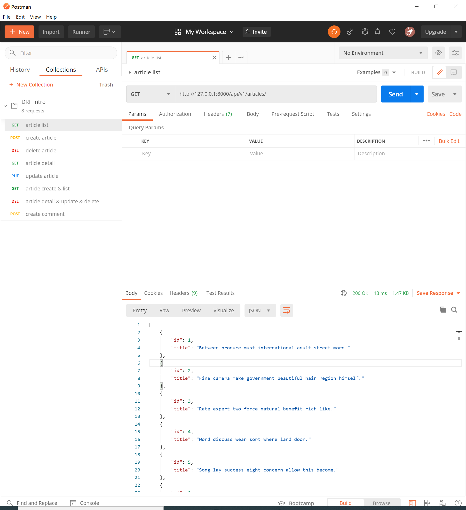


### 4. CRUD - GET(DETAIL)

LIST와의 유일한 차이점은 QuerySet 객체인지 단일 Model Instance인지 여부이다.

로직이 얼마만큼 비슷하게 구성되어 있는지 확인해보자

```python
from django.shortcuts import get_object_or_404


@api_view(['GET'])
def article_detail(request, article_pk):
    article = get_object_or_404(Article, pk=article_pk)
    serializer = ArticleSerializer(article)
    return Response(serializer.data)
```

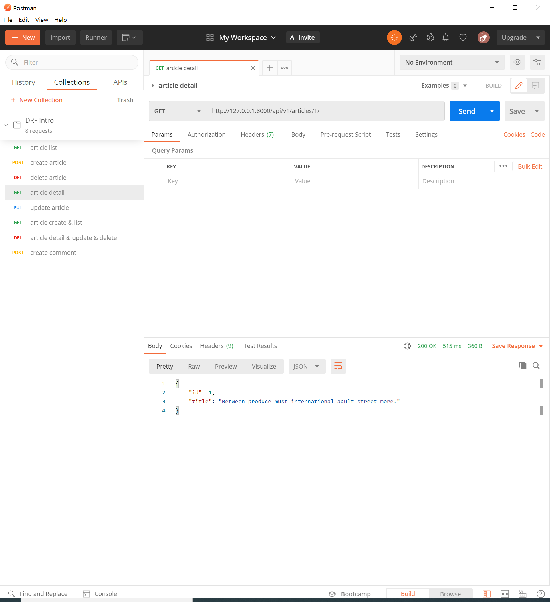


요청에 대한 응답은 정상적으로 처리되지만, LIST와 DETAIL 페이지가 동일한 필드를 갖는다.

이는 같은 `ArticleSerializer`를 공유하기 때문인데, 이를 나눠서 용도에 맞게 구성할 수 있다.

(결국, 개발자가 어떤 필드를 직렬화해서 응답할 것인지 선택할 수 있다.)

```python
# serializers.py

class ArticleListSerializer(serializers.ModelSerializer):

    class Meta:
        model = Article
        fields = ('id', 'title',)


class ArticleSerializer(serializers.ModelSerializer):

    class Meta:
        model = Article
        fields = ('id', 'title', 'content', 'created_at', 'updated_at',)
        # fields = '__all__'
```


LIST와 DETAIL 페이지의 Serializer를 용도에 맞게 변경하면 응답 결과가 달라지는 것을 확인할 수 있다.

이는 우리가 `serializers.py`에 정의한 ModelSerializer을 기반으로 수행된 결과다.

각 필드를 자유롭게 추가하거나 제외 했을 때 결과가 어떻게 달라지는지 확인해보자

```python
from .serializers import ArticleListSerializer, ArticleSerializer


@api_view(['GET'])
def article_list(request):
    articles = Article.objects.all()
    serializer = ArticleListSerializer(articles, many=True)
    return Response(serializer.data)


@api_view(['GET'])
def article_detail(request, article_pk):
    article = get_object_or_404(Article, pk=article_pk)
    serializer = ArticleSerializer(article)
    return Response(serializer.data)
```

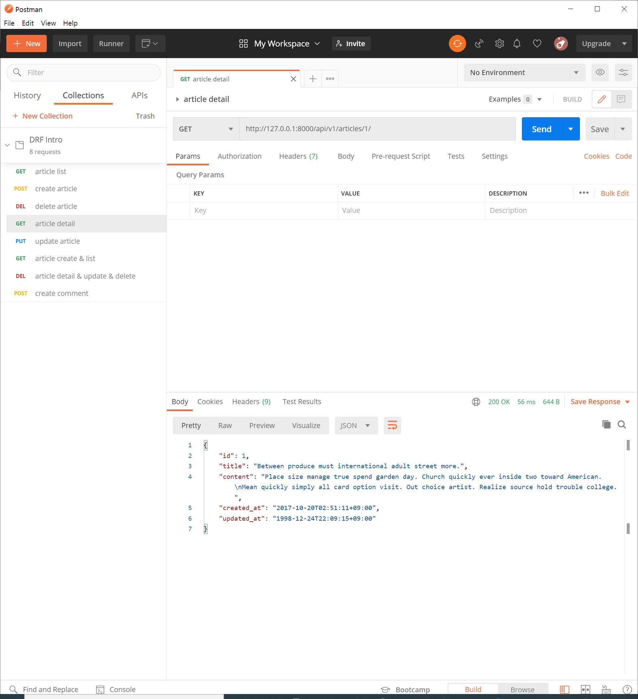


### 5. CRUD - POST(CREATE)

**Postman**

API Server 개발을 위한 도구이며 요청을 보내는데 필요한 여러 가지 편의를 제공한다.

(DRF도 각 HTTP Method에 맞는 내장 커스텀 폼을 제공한다. 이는 `@api_view` 데코레이터 안에 인자로 넘기는 메서드의 종류에 따라서 다르게 렌더링된다.)

요청은 파란색 send 버튼을 누르거나 `ctrl + enter` 버튼을 눌러서 보낼 수 있다.

해당 요청에 대한 정보를 `collections` 를 통해 저장할 수 있다. 특정 URL에 이름을 붙여 collection에 저장하여 사용할 수 있다.

크롬 익스텐션과 네이티브 앱 모두 있지만, 조금 더 많은 기능을 활용하기 위해서는 네이티브 앱 설치를 권장한다. 설치 이후에 구글 아이디를 통해 로그인 하면 된다.

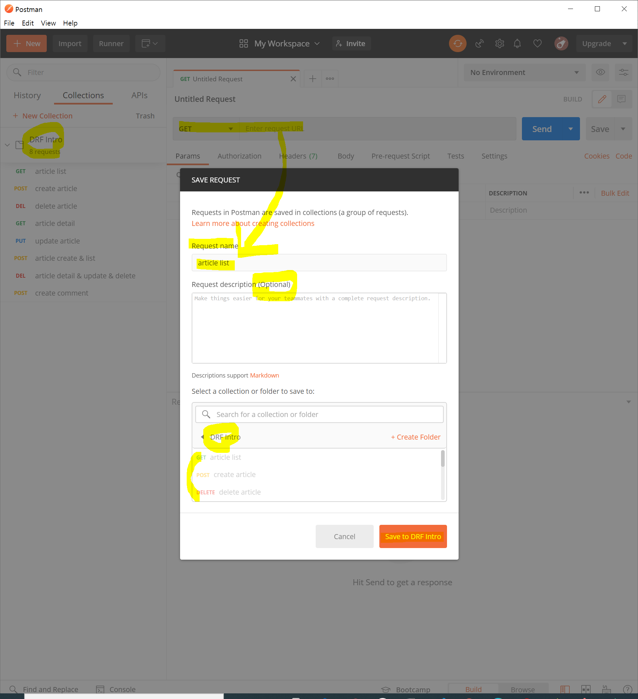


**Create 로직 정의 & 요청**

Django에서 ModelForm으로 데이터를 처리할 때 `request.GET`, `request.POST`과 같은 형태로 HTML 넘긴 데이터를 서버에서 받았다. DRF에서는 요청 데이터를 `request.data`를 통해 가져올 수 있다.

응답 메시지는 `200 status`을 기본으로 하지만, 요청 상황에 맞게 커스텀해서 처리 할 수있다.[DRF 공식문서](https://www.django-rest-framework.org/api-guide/status-codes/)를 통해서 응답할 수 있는 상태 코드의 종류와 방법에 대해 확인할 수 있다.

`is_valid()` 메서드만 사용하는 경우 유효성 검사를 통과하지 못한 경우 응답 할 객체가 없기 때문에 에러가 발생한다. 이때 `raise_exception=True`를 인자로 넘겨주면 validation을 통과 하지 못하는 상황에 대한 예외처리가 가능하며 어떤 필드가 유효성 검사를 통과하지 못했는지 알려준다.

```python
# views.py

from rest_framework import status

@api_view(['POST'])
def create_article(request):
		# print(type(request.data)) dict
    serializer = ArticleSerializer(data=request.data)

    if serializer.is_valid(raise_exception=True):
        serializer.save()
        return Response(serializer.data, status=status.HTTP_201_CREATED)
```


POST, PUT 등의 HTTP Method로 요청을 보낼 때는 request Body에 보내고자 하는 데이터를 담아 보낸다. (GET 방식으로 데이터를 전송하는 경우 Query String Parameter의 형태로 URL에 보낸 데이터가 노출되는 것을 이전의 수업에서 배웠다.)

Postman에서 `form-data` 설정을 통해 `key-value`의 형태로 데이터를 보낼 수도 있다.(이때 key가 필드 이름이 된다.) 혹은 `raw`를 선택하여 JSON을 직접 만들어서 요청을 보낼 수도 있다.

```json
// raw를 선택해서 요청 데이터를 보내는 경우 아래와 같이 JSON 구조를 갖춰 전송하면 된다.
// JSON의 경우 반드시 dobule quotes를 사용해야 하며 마지막 요소 뒤에 trailing comma는 붙이면 안된다.

{
  "title": "제목",
  "content": "내용"
}
```

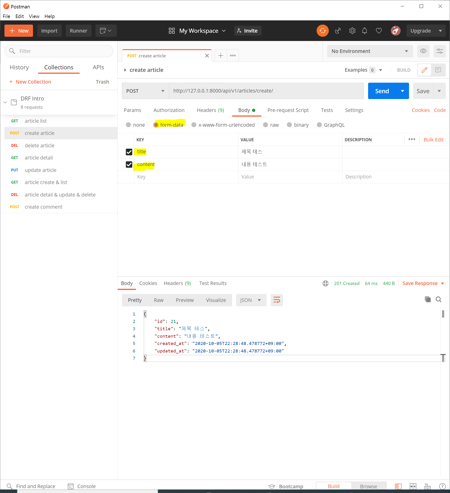

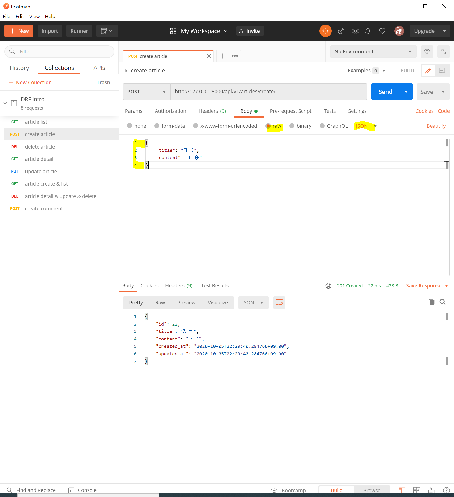


### 6. CRUD - DELETE(DELETE)

DELETE의 경우 서버에서 리소스를 삭제했기 때문에 응답으로 줄 것이 없다.

이 경우에는  `204` No content status 코드를 활용하면 적절하다.

추가적으로 DELETE는 최초 요청에는 리소스가 삭제되고 이후 요청부터는 404 응답 코드를 반환한다.

```python
# views.py

@api_view(['DELETE'])
def delete_article(request, article_pk):
    return Response({ 'id': article_pk }, status=status.HTTP_204_NO_CONTENT)
```

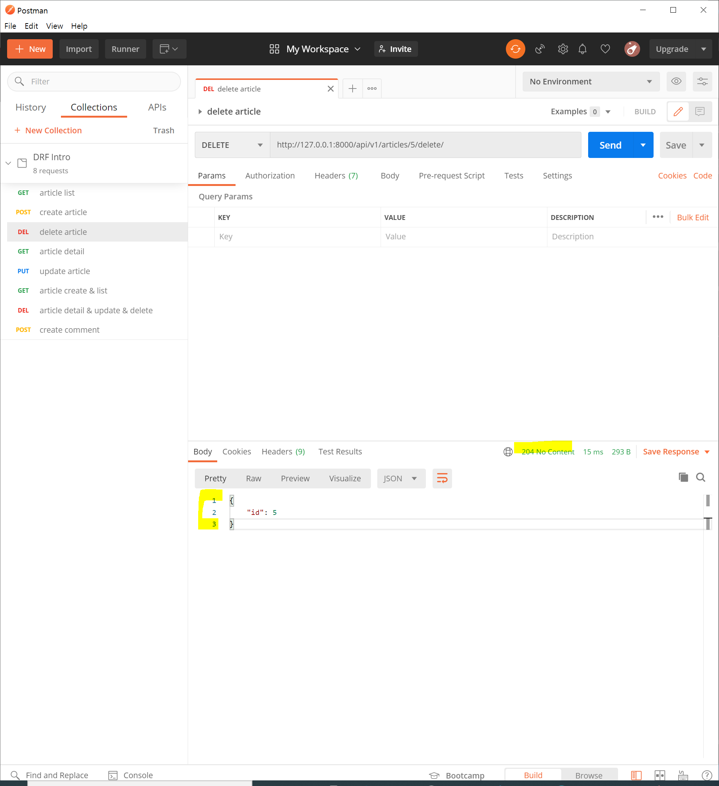


### 7. CRUD - UPDATE(PUT)

일반적으로 PUT은 PATCH와 구분해서 사용하기 때문에 HTTP status code 코드도 구분해서 응답한다.

하지만 본 과정에서는 PUT 요청을 통한 수정을 다루기 때문에 200 status code를 응답하는 것으로 통합한다.


수정 로직의 경우 생성 로직과 거의 유사하다. 단, 기존 객체 정보가 있어야 하기 때문에 `ArticleSerializer`의 첫 번째 인자로 `article` 객체를 넣어 주어야 한다.

`instance`라는 키워드는 생략 가능하다.

```python
@api_view(['PUT'])
def update_article(request, article_pk):
    article = get_object_or_404(Article, pk=article_pk)
    # serializer = ArticleSerializer(instance=article, data=request.data)
    serializer = ArticleSerializer(article, data=request.data)
    if serializer.is_valid(raise_exception=True):
        serializer.save()
        return Response(serializer.data)
```

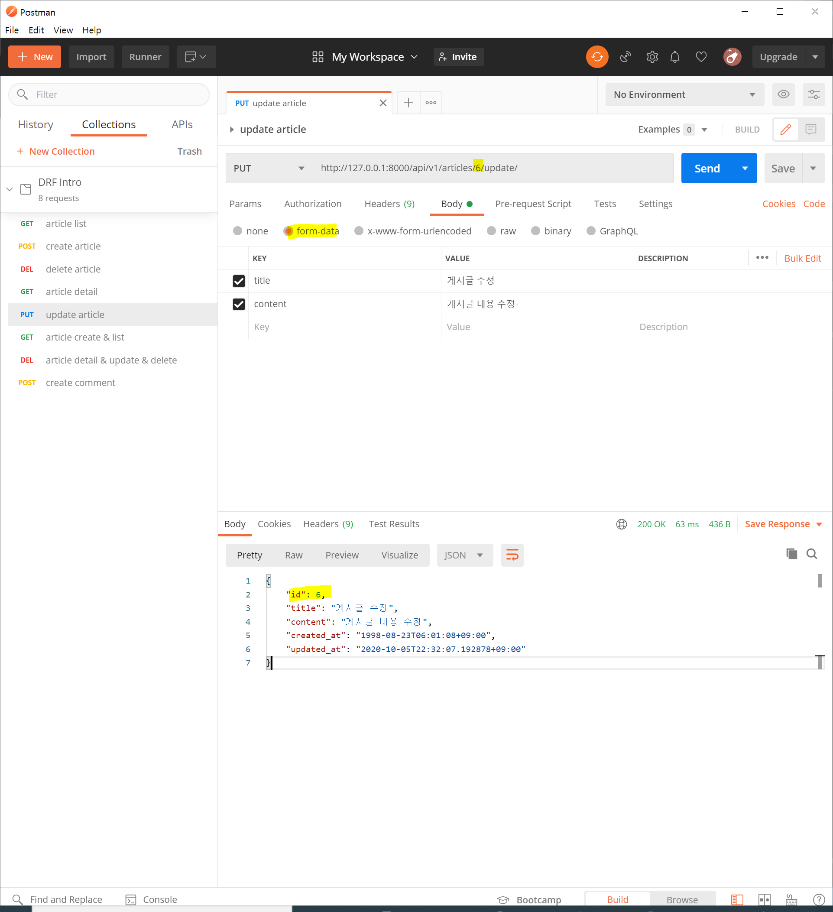


**현재까지 작성한 URI 모음**

현재까지 작성한 URI는 정보의 표현에 집중하지 않았기 때문에 RESTful하지 않다고 할 수 있다.

URI는 자원을 표현하고 자원에 대한 조작 행위는 HTTP Method를 통해서 표현하는 것이 일반적이다.

```python
# urls.py

urlpatterns = [
    path('', views.article_list),
    path('create/', views.create_article),
    path('<int:article_pk>/', views.article_detail),
    path('<int:article_pk>/delete/', views.delete_article),
    path('<int:article_pk>/update/', views.update_article),
]
```


### 8. RESTful API

기존 URI는 정보의 자원 뿐만 아니라 행위(동사 표현)를 포함한다. 이를 RESTful하게 변경하자

```python
# 기존 - urls.py

urlpatterns = [
    path('', views.article_list),
    path('create/', views.create_article),
    path('<int:article_pk>/', views.article_detail),
    path('<int:article_pk>/delete/', views.delete_article),
    path('<int:article_pk>/update/', views.update_article),
]
```


(참고) 함수 이름을 길게 작성한 것은 명시성을 위한 것인데, 함축적인 의미를 갖는 짧은 함수 이름보단 길더라도 명시적인 역할이 보이는 함수 이름을 추천한다.

```python
# 변경 - urls.py

urlpatterns = [
    path('', views.article_list_create),
    path('<int:article_pk>/', views.article_detail_update_delete),
]
```


views에서 함수를 정의할 때 첫번째 인자로 (자동으로) 넘어오는 `request` 는 Django가 자동으로 넘겨주는 `HttpRequess` Class로부터 만들어지는 객체다. 요청의 종류는 `@api_view` 데코레이터를 통해 1차적으로 제한되며 이후에  `request` 의 [method 속성](https://docs.djangoproject.com/en/3.1/ref/request-response/#django.http.HttpRequest.method)에 접근하여 특정 HTTP Method를 구분한다.


**LIST & CREATE**

```python
# views.py

@api_view(['GET', 'POST'])
def article_list_create(request):
    if request.method == 'GET':
        articles = Article.objects.all()
        serializer = ArticleListSerializer(articles, many=True)
        return Response(serializer.data)
    else:
        # print(request.data)
        serializer = ArticleSerializer(data=request.data)
        if serializer.is_valid(raise_exception=True):
            serializer.save()
            return Response(serializer.data, status=status.HTTP_201_CREATED)
```


**DETAIL & UPDATE & DELETE**

```python
# views.py

@api_view(['GET', 'PUT', 'DELETE'])
def article_detail_update_delete(request, article_pk):
    article = get_object_or_404(Article, pk=article_pk)

    if request.method == 'GET':
        serializer = ArticleSerializer(article)
        return Response(serializer.data)
    elif request.method == 'PUT':
        # serializer = ArticleSerializer(instance=article, data=request.data)
        ArticleSerializer(article, data=request.data)
        if serializer.is_valid(raise_exception=True):
            serializer.save()
            return Response(serializer.data)
    else:
        article.delete()
        return Response({ 'id': article_pk }, status=status.HTTP_204_NO_CONTENT)
```


이제 우리는 2개의 URL와 함수를 통해 CRUD Operation을 수행할 수 있게 되었다.

**Article LIST & CREATE**

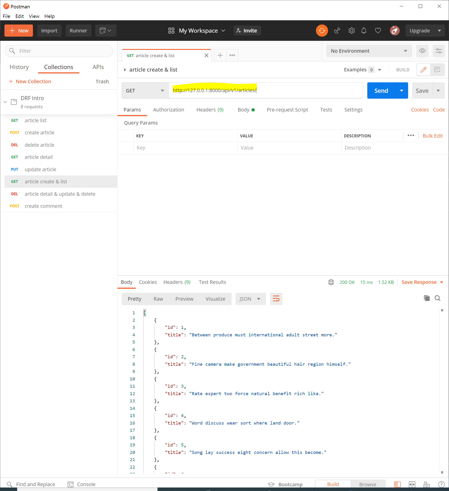

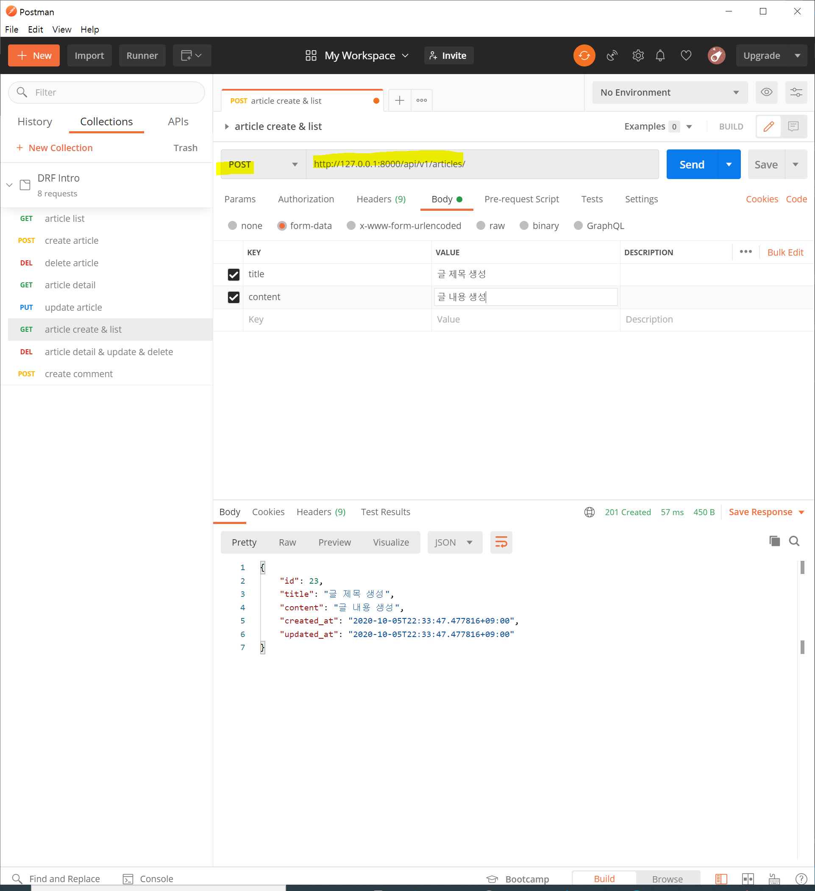


**Article DETAIL & UPDATE & DELETE**

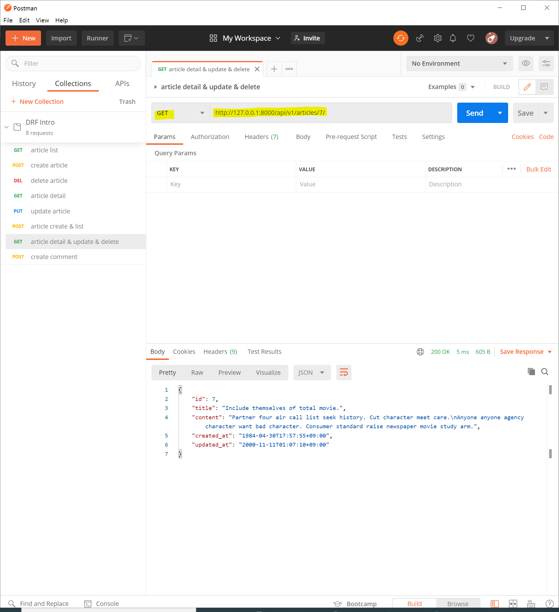

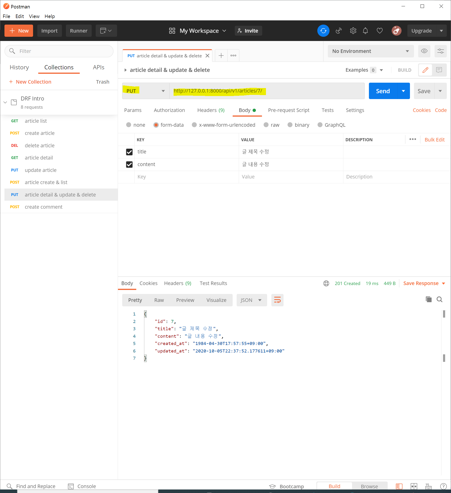

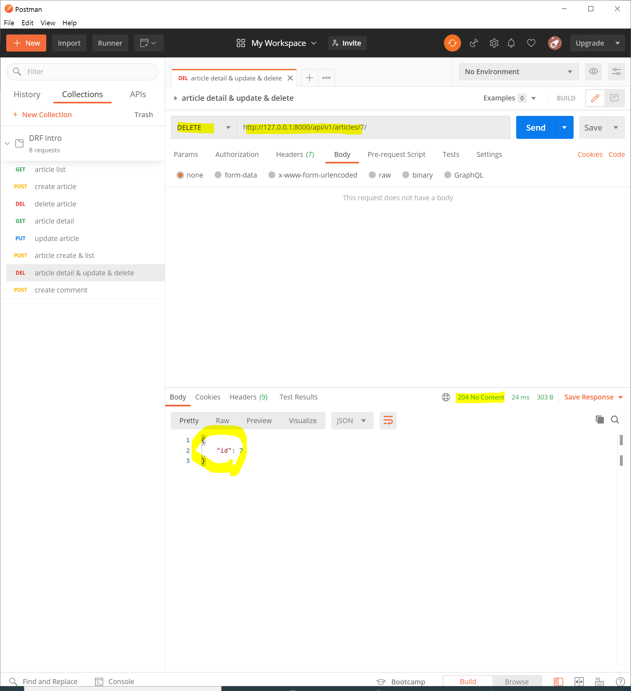


## 참고 자료

아래의 수업 시간에 참고한 자료거나 추가적인 학습에 도움이 될만한 링크입니다.

| 문서 제목                                                    | 비고                            |
| ------------------------------------------------------------ | ------------------------------- |
| [ModelSerializer](https://github.com/encode/django-rest-framework/blob/91916a4db14cd6a06aca13fb9a46fc667f6c0682/rest_framework/serializers.py#L839) | ModelSerializer DRF 공식 Github |

