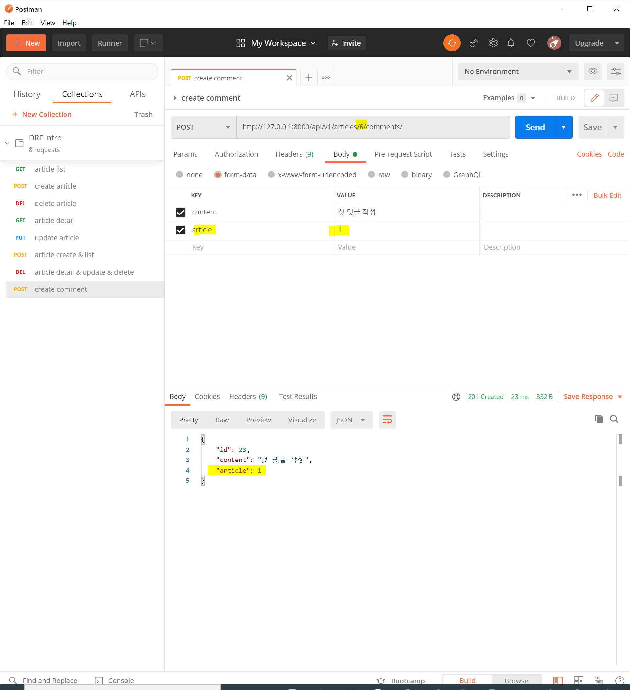

# 02_drf_article_and_comment_crud

> 2020.10.05 오후 라이브
>
> 실제 라이브에서 다루지 않았던 내용까지 추가로 포함되어 있습니다. 조금 더 심화적인 내용을 다루니 01번 문서 내용이 이해되지 않는다면 우선적으로 해당 내용을 충분한 학습 이후에 보시는 것을 추천합니다.


## 핵심 개념

**Article & Comment CRUD**

*"1:N Model Relation에서의 Serialization"*

기존에 작성했던 단일 모델에서의 직렬화가 아닌 1:N relation에서 직렬화 작업을 진행해보자

이 과정에서 발생하는 이슈의 원인을 찾아보고 해결하는 과정까지 같이 알아보자


## Article & Comment CRUD

### 1. DB 초기화

현재까지 진행한 DB를 초기화하자. `db.sqlite3` & `migrations` 내부의 설계도를 삭제하고 `Comment` 모델을 추가한다.

```python
# models.py

class Comment(models.Model):
    content = models.TextField()
    created_at = models.DateTimeField(auto_now_add=True)
    updated_at = models.DateTimeField(auto_now=True)
    article = models.ForeignKey(Article, on_delete=models.CASCADE)
```


마이그레이션 작업 이후에 seed 데이터를 추가한다.

 `django-seed`의 경우 특정 앱 안에 있는 모든 모델에 dummy 데이터를 생성한다.

```bash
$ python manage.py makemigrations
$ python manage.py migrate

# seed 데이터 생성 -> articles 앱 아래 있는 모든 모델에(Article, Comment) data seeding 진행
# 개수를 정하지 않은 경우 default 10개를 생성한다.
$ python manage.py seed articles --number=20
```


### 2. CommentSerializer & Comment - POST(CREATE)

comment의 경우 id, content, 그리고 어떠한 article에 쓰여진 댓글인지 여부를 확인하기 위해 `article` 필드를 넣는다.

```python
# serializers.py

from .models import Article, Comment


class CommentSerializer(serializers.ModelSerializer):

    class Meta:
        model = Comment
        fields = ('id', 'content', 'article',)
```

```python
# urls.py

urlpatterns = [
  path('<int:article_pk>/comments/', views.create_comment),
]
```


사실상 로직은 `create_article` 로직과 동일하다. Serializing을 진행하는 대상만 다를 뿐 모든 과정이 같다.

POST 요청은 데이터를 받아서 ModelSerializer를 통해 직렬화 작업을 거친 후 DB에 저장하는 일련의 과정을 이해하는 것이 중요하다.

```python
# views.py

from .serializers import ArticleListSerializer, ArticleSerializer, CommentSerializer


@api_view(['POST'])
def create_comment(request, article_pk):
    serializer = CommentSerializer(data=request.data)
    if serializer.is_valid(raise_exception=True):
        serializer.save()
        return Response(serializer.data, status=status.HTTP_201_CREATED)
```


### 3. 문제 상황

`create_comment` 함수와 매핑된 경로로 요청을 보내면 아래와 같이 validation checking 과정에서 이슈가 발생한다. 이는 CommentSerializer를 작성할 때, `article` 필드를 넣었음에도 `form-data`에서 데이터를 전송하지 않았기 때문이다.


그래서 아래처럼 `form-data`에 참조하는 article 정보를 포함시켜서 요청을 보내면 요청이 간다.

 

다만, 이 경우 주소창으로 넘어온 article에 달리는 댓글이 아닌 `form-data`로 직접 하드 코딩해서 넘긴 article에 달리는 댓글이 되어버리는 이상한 일이 발생한다.

이런 상황을 막기 위해 '읽기 전용' 필드를 설정이 필요하다.


DRF 공식 문서에서 [읽기 전용 필드](https://www.django-rest-framework.org/api-guide/serializers/#specifying-read-only-fields)를 찾아 설정하고 다시 요청을 보내보자. 읽기 전용 필드로 설정하는 순간 해당 필드는 `is.valid()` 메서드에서 유효성 검사를 진행하지 않는다. 이제는 기존 유효성 검사 관련 에러는 사라진다. 하지만 새로운 에러가 발생한다.

```python
# views.py

class CommentSerializer(serializers.ModelSerializer):

    class Meta:
        model = Comment
        fields = ('id', 'content', 'article',)
        read_only_fields = ('article',)
```


위의 에러는 우리가 Django 수업을 하며 가장 대응하기 어려웠던 에러 중의 하나였다. 이는 데이터 무결성 에러로 validation은 통과 했지만, 데이터베이스에 저장하는 시점에 comment가 참조해야 하는 대상 객체(부모 객체)를 지정하지 않았기 때문에 발생하는 오류다.

아래의 코드에서 `# 1`은 form에서 전송된 데이터의 유효성 검사를 진행하는 부분이고 `# 2`는 데이터베이스 차원에서 다시 한번 유효성 검사를 진행하는 부분이다.

즉, `read_only` 필드를 지정하는 경우 `# 1`에서 검사를 진행하지 않겠다는 의미고 저걸 통과하더라도 (이 시점에서는 데이터를 넘겨주지 않아도 에러가 발생하지 않음) 데이터가 넘어오지 않은 상태이기 때문에 `.save()`로 저장하는 시점에서는 다시 한번 에러가 발생한다.

```python
# views.py

@api_view(['POST'])
def create_comment(request, article_pk):
    article = get_object_or_404(Article, pk=article_pk)
    serializer = CommentSerializer(data=request.data) # 1
    if serializer.is_valid(raise_exception=True): # 2
        serializer.save()
        return Response(serializer.data, status=status.HTTP_201_CREATED)
```


우리는 `.save()`를 하는 시점에 데이터를 넘겨주어야 한다. 이때 DRF는 [공식 문서](https://www.django-rest-framework.org/api-guide/serializers/#passing-additional-attributes-to-save)에서 `.save()`의 키워드 인자 형태로 `request.data`에 포함되지 않은 데이터를 넘겨줄 수 있다고 얘기한다. 아래와 같이 진행하고 다시 요청을 보내보자.

이제는 form validation 문제도 발생하지 않고 DB에 저장하는 시점에 url로 넘어온 pk에 해당하는 article을 정상적으로 넘겨줘 참조하여 저장할 수 있게 되었다.

```python
# views.py

@api_view(['POST'])
def create_comment(request, article_pk):
    article = get_object_or_404(Article, pk=article_pk)
    serializer = CommentSerializer(data=request.data)
    if serializer.is_valid(raise_exception=True):
        serializer.save(article=article)
        return Response(serializer.data, status=status.HTTP_201_CREATED)
```


### 4.  Comment - GET(LIST)

```python
# urls.py

urlpatterns = [
  path('comments/', views.comment_list),
]
```

Article List를 조회하는 로직과 완전히 동일하다.

```python
# views.py

from .models import Article, Comment


@api_view(['GET'])
def comment_list(request):
    comments = Comment.objects.all()
    serializer = CommentSerializer(comments, many=True)
    return Response(serializer.data)
```


### 5.  Comment - GET & UPDATE(PUT) & DELETE

Comment 로직을 작성하면서 comments를 `articles/comments/1/`의 형태로 작성하는 부분이 RESTful의 계층화적 특징에서 보면 살짝 어색하다.

모든 `게시글들/댓글들/1`의 모습으로 작성되는데, 이러한 형태보다는 `댓글들/1`의 형태가 조금 더 자연스럽다. 수정해보자.

```python
# api/urls.py

urlpatterns = [
    path('admin/', admin.site.urls),
    path('api/v1/', include('articles.urls')),
]
```

```python
# articles/urls.py

urlpatterns = [
    path('articles/', views.article_list_create),
    path('articles/<int:article_pk>/', views.article_detail_update_delete),
    path('articles/<int:article_pk>/comments/', views.create_comment),

    path('comments/', views.comment_list),
    path('comments/<int:comment_pk>/', views.comment_detail_update_delete),
]
```


댓글의 로직도 게시글의 로직과 완전히 동일히다.

Article & Comment 두 코드를 한번에 비교해보면, 결국 동일한 행동을 반복하고 있음을 알게 된다.

```python
# views.py

@api_view(['GET', 'PUT', 'DELETE'])
def comment_detail_update_delete(request, comment_pk):
    comment = get_object_or_404(Comment, pk=comment_pk)
    if request.method == 'GET':
        serializer = CommentSerializer(comment)
        return Response(serializer.data)
    elif request.method == 'PUT':
        serializer = CommentSerializer(comment, data=request.data)
        if serializer.is_valid(raise_exception=True):
            serializer.save()
            return Response(serializer.data)
    else:
        comment.delete()
        return Response({ 'id': comment_pk }, status=status.HTTP_204_NO_CONTENT)
```


### 6. Comment에서 Article 정보 확인하기

**댓글 정보 확인**

한 가지 아쉬운 것은 게시글을 조회할 때, 댓글을 같이 확인할 수 없다는 점이다. 이를 해결해보자.


1:N 관계에서 N(댓글)은 1을 직접 참조할 수 있다. 하지만 1은 N의 개수를 보장할 수 없기 때문에 직접 참조 할 수 없다. 그래서 Django Model은 `_set` 이라고 하는 API를 제공한다.

```python
# N -> 1: OK
comment.article

# 1 -> N: Nope!
article.comment

# 1 -> N: _set
article.comment_set.all()
```


우리가 정의한`Article` 모델도 당연히 Django 기반의 모델이기 때문에 기본적으로 `comment_set` 필드가 있다. `comment_set` 을 필드에 추가해보고 다시 Postman을 통해 요청을 보내보자.

```python
# serializers.py

class ArticleSerializer(serializers.ModelSerializer):

    class Meta:
        model = Article
        fields = ('id', 'title', 'content', 'created_at', 'updated_at', 'comment_set',)
```


결과를 확인해보면 배열 안에 해당 게시글에 달린 댓글의 id가 들어있는 것을 확인할 수 있다. 이는 실제 `article` 객체를 참조하더라도 Django Model 내부적으로는 id 값만 참조하기 때문이다. (이런 이유 때문에 실제 `article` 이라고 Model 필드 이름을 설정해도 `_id` 형태로 필드를 변경하는 것이다.)


하지만 우리는 조금 더 추가적인 필드, 이를테면 `CommentSerializer`가 가진 `id`, `content` 와 같은 필드를 상세 게시글을 조회할 때 같이 보고 싶다.


DRF에서는 특정 ModelSerializer에서 다른 ModelSerializer를 참조하는 것이 가능하다.

- `many=True` 인자를 넘긴 이유는 시리얼라이징의 대상이 되는 객체가 `_set`으로 QuerySet이기 때문이다.
- 결과를 확인해보면 CommentSerializer와 같은 필드가 QuerySet 객체 안에 들어가서 직렬화 된 것을 확인

```python
# serializers.py

class ArticleSerializer(serializers.ModelSerializer):
    comment_set = CommentSerializer(
        many=True,
    )

    class Meta:
        model = Article
        fields = ('id', 'title', 'content', 'created_at', 'updated_at', 'comment_set',)
```


참고로 DRF는 ModelSerializer에서 추가적인 필드를 구성하거나 존재하는 필드를 override할 수 있도록 기능을 제공한다. 자세한 내용은 [공식 문서](https://www.django-rest-framework.org/api-guide/serializers/#specifying-fields-explicitly)를 참고하면 확실한 정보를 얻을 수 있다.


**댓글 개수 확인**

댓글의 개수도 필드로 추가해보자. `comment_set`의 경우 기존에 있는 필드를 override해서 사용한 것이고 `comment_count`의 경우 `ArticleSerializer`가 기존에 가지고 있었던 필드가 아니다. 즉, 추가적인 필드이며 이럴 경우 `serializers` 안에 있는 커스텀 필드를 사용한다.

*커스텀 필드가 원래 Django Model이 알고 있는 필드의 이름이 아니라면(이 상황에서는 `comment_count`) `source` 속성을 통해 어떤 자원을 통해서 가져올지 명시해야 한다.* `source`에 대한

자세한 내용은 [공식 문서](https://www.django-rest-framework.org/api-guide/fields/#source)를 통해서 확인할 수 있습니다.

```python
# serializers.py

class ArticleSerializer(serializers.ModelSerializer):
    comment_set = CommentSerializer(
        many=True,
    )

    comment_count = serializers.IntegerField(
        source='comment_set.count',
    )

    class Meta:
        model = Article
        fields = ('id', 'title', 'content', 'created_at', 'updated_at', 'comment_set', 'comment_count',)
```


이제는 댓글의 개수까지 정상적으로 보인다.


**마지막 이슈**

모든 코드가 정상적으로 동작하는 것처럼 보이지만 딱 한 가지 문제점이 더 해결이 안된 듯 하다. 게시글을 작성하면 `comment_set`과 `comment_count` 필드가 form validation을 통과하지 못한다. Meta 클래스의 필드에는 넣어 줬지만 이 필드들은 form을 통해 넘겨주는 데이터가 아니기 때문에 발생한 오류다.

이는 우리가 아까 배웠던 읽기 전용 필드의 설정으로 쉽게 해결할 수 있다.

아래와 같이 코드를 수정하고 다시 요청을 보내면 정상적으로 글이 작성된다.


```python
# serializers.py

class ArticleSerializer(serializers.ModelSerializer):
    comment_set = CommentSerializer(
        many=True,
        read_only=True,
    )

    comment_count = serializers.IntegerField(
        source='comment_set.count',
        read_only=True,
    )

    class Meta:
        model = Article
        fields = ('id', 'title', 'content', 'created_at', 'updated_at', 'comment_set', 'comment_count',)

```


