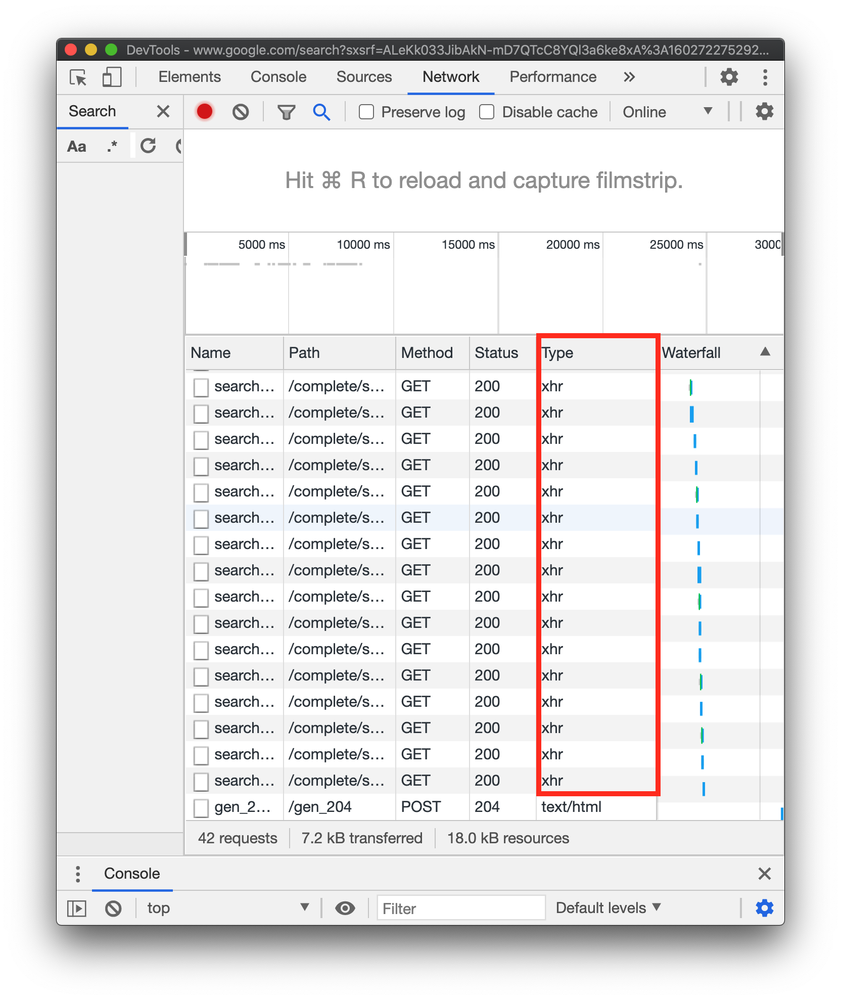

# 00_AJAX

> 2020.10.14 오전 라이브

[강의 코드](https://lab.ssafy.com/ssafy4/javascript)


## 핵심 개념

**JavaScript Coding Style Guide**

*"코드에 대한 첫 인상은 진한 잔상을 남긴다."*

- 스타일 가이드에 맞춰 코드를 작성하는 것은 기본을 지키는 것이다.
- 스타일 가이드를 따르지 않은 코드는 매우 어색하며 본질(로직)에 접근하는 것을 방해한다.


**What we do?**

우리는 기존에 작성한 '좋아요' 로직을 Ajax 요청으로 변경 할 것이다.

1. 페이지의 새로고침 없이 Client에서 Server에 Axios를 활용해 비동기 요청을 보낸다.
2. Server는 JSON으로 데이터를 응답하고 이 데이터를 활용해 JavaScript로 DOM을 조작한다.


**AJAX(Asynchronous Javascript And XML)**

*서버와 통신하기 위해 XMLHttpRequest 객체를 사용하는 것*

1. Google map, Google Search, Gmail 등에 사용된 기술을 설명하기 위해 등장한 개념

   

   - 구글 지도, 검색 등에서 스크롤을 하거나 입력하는 모든 행위는 '요청'이다. 
   - 새로운 기술이 아닌 기존에 존재하던 기술을 설명하기 위한 용어 

2. 다음과 같은 특징을 지닌다.

   - reload하지 않고 요청 작업을 비동기적으로 수행할 수 있다. (사용자 경험 향상)
   - 페이지의 전체가 아닌 일부만을 업데이트 할 수 있다. 

   - HTML, JSON, XML, 그리고 일반 텍스트 등을 교환할 수 있다.


**XHR(XMLHttpRequest)**

*브라우저 내장 객체*

1. 서버와 상호작용하기 위해서 사용한다. 전체 페이지의 새로 고침없이 데이터를 받아올 수 있다. 
2. 사용자가 하는 것을 방해하지 않고(== 새로고침이 발생하지 않는다.) 페이지의 일부를 업데이트 할 수 있다.
3. 주로 AJAX 프로그래밍에 사용한다. 


**How JavaScript works?**

1. <u>Asynchronous</u>

   > "기다려주지 않는다."

   ```python
   # Python 
   
   import requests
   import json
   
   
   res = requests.get('https://jsonplaceholder.typicode.com/todos/1').text
   
   print(res) # { 'userId': 1, 'id': 1, 'title': 'delectus aut autem', ... }
   ```

   ```javascript
   // JavaScript
   
   const xhr = new XMLHttpRequest()
   
   xhr.open('GET', 'https://jsonplaceholder.typicode.com/todos/1')
   xhr.send()
   
   const res = xhr.response
   
   console.log(res) // ''
   ```

   왜 기다려주지 않을까?

   

2. <u>Single Thread</u>

   > "혼자 일하기 때문에 기다릴 수가 없다."

   외부 서버로 요청을 보내는 상황을 가정해보자

   1. 기다리는 상황
      - 요청을 보내고 응답을 기다린다. 
      - 응답이 오면 후에 남은 일을 처리한다.
      - 만약 응답이 1시간 뒤에 온다면 뒤에 해야하는 일을 그 시간 동안 할 수 없다.
   2. 기다리지 않는 상황
      - 요청을 보내고 응답을 기다리지 않고 다른 일을 한다.
      - 응답이 오면 그때 그 일을 처리한다.
      - 응답이 1시간 뒤에 오더라도 상관없다.

   

3. <u>Event Loop</u>

   > "JavaScript가 혼자서 일하는 방법"

   - Call Stack

     - 함수의 호출을 기록하는 Stack 자료 구조

     - 한 번에 하나의 작업만 처리할 수 있으며 함수의 처리는 Stack이 다시 비워질 때까지 계속 이어진다.

   - Web API(Browser API)

     - 브라우저에서 제공하는 API

     - `setTimeout`, `setInerval`, `XHR`

   - Task Queue

     - Callback Function이 대기하는 Queue 자료 구조
     - 전송 순서대로 작업을 처리하기 위해 Queue 자료 구조를 사용함

   - Event Loop

     - Call Stack이 비어있으면 Task Queue의 함수를 Call Stack으로 보낸다.


**Callback Function**

*"다른 함수의 인자로 전달되는 함수"*

1급 객체(First-Class Citizen)

> "다른 객체들에 일반적으로 적용 가능한 연산을 모두 지원하는 객체"


아래와 같은 특징을 지니면 1급 객체라고 부른다.

1. return 값으로 사용 가능
2. **<u>함수의 인자로 사용 가능</u>**
3. 변수에 할당 가능

JavaScript(+Python)의 함수는 위와 같은 특징 3가지를 모두 만족하므로 1급 객체의 특성을 가진다. 


Callback은 이러한 특징 중 "인자로 넘어간다."라는 특징에 해당한다. 우리는 지금까지 이러한 특징을 알게 모르게 활용했다. 

1. Python 

   ```python
   # python - map
   
   numbers = [1, 2, 3]
   
   def add_one(number):
       return number + 1
   
   map(add_one, numbers)
   ```

   ```python
   # django - urls.py
   
   from django.urls import path
   from . import views
   
   urlpatterns = [
       path('', views.index)
   ]
   ```

   

2. JavaScript

   ```javascript
   // Array Helper Method - forEach
   
   const numbers = [1, 2, 3, 4]
   const newNumbers = []
   
   numbers.forEach(function (number) {
     newNumbers.push(number)
   })
   ```

   ```javascript
   // addEventListener
   
   const button = document.querySelector('button')
   
   button.addEventListener('click', function () {
     alert('콜백 함수 호출!')
   })
   ```

우리가 직접적으로 함수를 호출을 하지 않고 어떠한 순간(이벤트 발생), 혹은 과정 속에서 함수를 호출한다.

비동기 처리의 과정은 요청한 결과가 처리되는 '**특정 시점**'에 '**어떠한 일(콜백 함수)**'을 이어나는 형태로 이루어진다. (주의 해야 할 것은 비동기 처리에 콜백 함수는 반드시 필요하지만 콜백 함수를 사용하는 모든 로직이 비동기는 아니다.) 

어떠한 일의 결과가 다른 일의 trigger가 되는 과정이 연속적으로 발생하면 콜백 함수의 콜백 함수를 넣는 과정이 반복되고 이는 콜백 지옥(Callback Hell)로 이어진다.


**Promise**

*"비동기 작업이 맞이 할 미래의 결과(성공/실패)를 약속하는 객체"*

1. 콜백 지옥을 해결하기 위해 ES6부터 등장한 개념
2. 2가지의 약속이 이행되는 상황을 가정한다.
   - 성공
     - `.then(callback function)`
     - 성공하고 나면 무엇을 할 지 
   - 실패
     - `.catch(callback function)`
     - 실패하면 에러를 어떻게 처리(잡을지) 할 지


**Axios**

*"**Promise based** HTTP client for the browser and node.js"*

1. Promise 기반의 비동기 요청을 할 수 있는 JavaScript 라이브러리

2. 사용법

   ```javascript
   axios.get('https://jsonplaceholder.typicode.com/todos/asdf')
   	// Promise의 성공/실패에 대한 약속 이후의 처리를 할 수 있다.
     .then(function (res) {
       console.log(res)
       return res.data
     })
   	// 이전 .then 내부 CB의 return 값은 다음 .then 내부 CB의 인자로 넘어온다.
     .then(function (data) {
       console.log(data)
       return data.title
     })
     .then(function (title) {
       console.log(title)
     })
   	// Error는 요청를 1이 아닌 asdf로 변경해서 확인해보자
     .catch(function (err) {
       console.log(err)
     })
   ```

3. 참고 사항
   - Axios도 결국 내부적으로 `xhr`을 사용한다. 
   - 결국, 이를 편하고 직관적으로 사용할 수 있도록 만들어 놓은 라이브러리다.


**async & await**

"비동기 함수는 이벤트 루프를 통해 **비동기적으로 작동하는 함수**로, 암시적으로 [`Promise`](https://developer.mozilla.org/ko/docs/Web/JavaScript/Reference/Global_Objects/Promise)를 사용하여 결과를 반환합니다. **그러나 비동기 함수를 사용하는 코드의 구문과 구조는, 표준 동기 함수를 사용하는것과 많이 비슷**합니다. *-mdn-*"


1. 비동기 방식으로 처리하는 로직을 마치 동기적으로 보이게 만드는 Syntactic Sugar
2. 함수 앞에 `async` 키워드를 작성하고 내부적으로 비동기로 처리되는 로직 앞에 `await` 키워드를 작성한다.
   - `await` 연산자는 `Promise`를 기다리기 위해 사용하는데, `async function` 내부에서만 사용해야 원하는 방식으로 동작한다.

3. 사용법

   ```javascript
   // 함수 앞에 async 키워드를 작성한다.
   async function getTodo () {
     console.log('1')
     // Promise를 return하는 로직 앞에 await 키워드를 작성한다.
     await axios.get('https://jsonplaceholder.typicode.com/todos/1')
       .then(function (res) {
         console.log(res)
        })
     console.log('2')
   }
   
   getTodo()
   ```

   

## 참고 링크

아래의 수업 시간에 참고한 자료거나 추가적인 학습에 도움이 될만한 링크입니다.

| 문서 제목                                                    | 비고                   |
| ------------------------------------------------------------ | ---------------------- |
| [Airbnb JavaScript Style Guide](https://github.com/airbnb/javascript) | Airbnb Style Guide     |
| [Google Style Guides](https://google.github.io/styleguide/)  | Google Style Guide     |
| [JavaScript Standard Style](https://standardjs.com/rules-kokr.html) | JS Standard Code Style |
| [Ajax 시작하기](https://developer.mozilla.org/ko/docs/Web/Guide/AJAX/Getting_Started) | MDN                    |
| [Ajax](https://ko.wikipedia.org/wiki/Ajax)                   | 위키백과               |
| [XHR(XMLHttpRequest)](https://developer.mozilla.org/ko/docs/Glossary/XHR_(XMLHttpRequest)) | MDN                    |
| [async function](https://developer.mozilla.org/ko/docs/Web/JavaScript/Reference/Statements/async_function) | MDN                    |
| [await](https://developer.mozilla.org/ko/docs/Web/JavaScript/Reference/Operators/await) | MDN                    |

