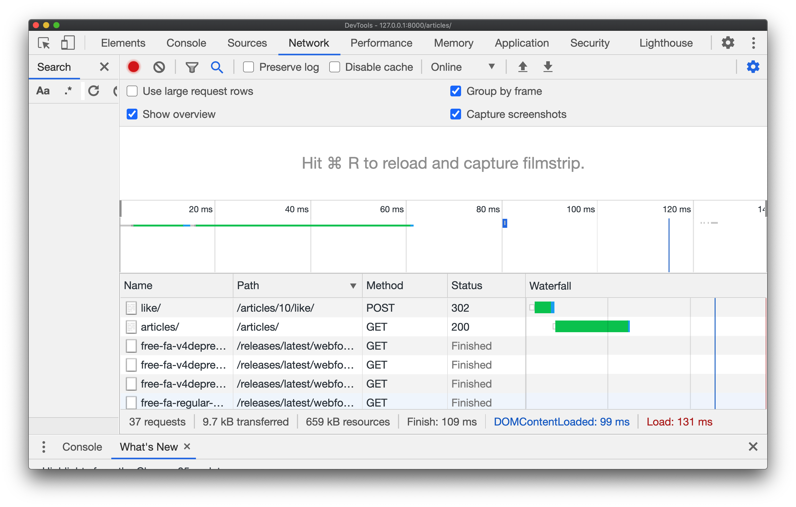
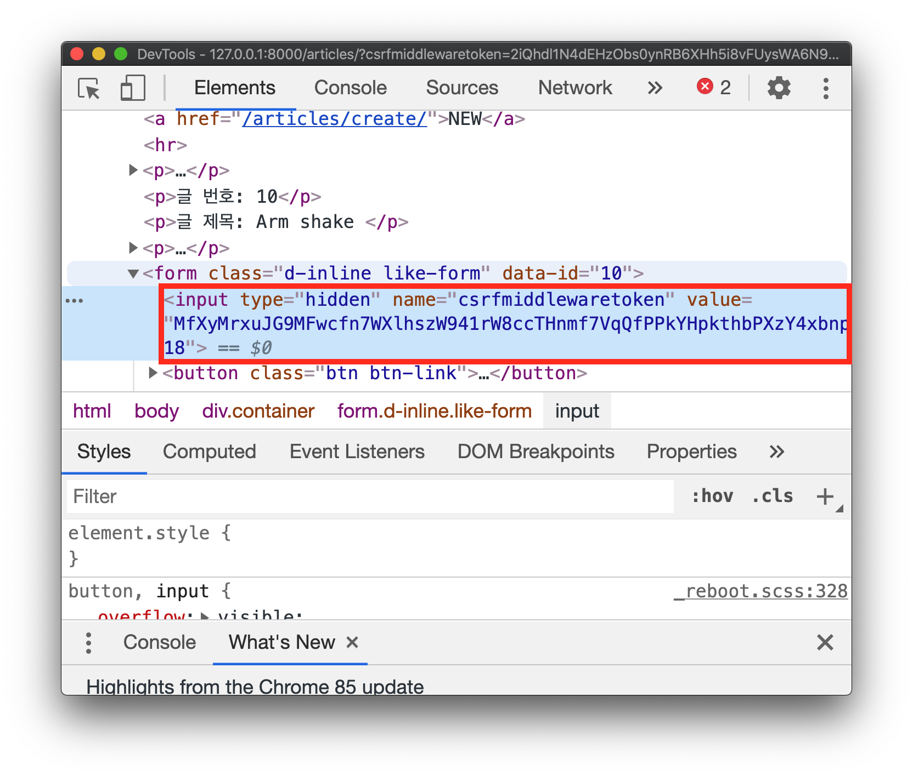

# 01_LikeWithAjax

> 2020.10.14 오후 라이브

[강의 코드](https://lab.ssafy.com/ssafy4/javascript)

gitlab에 스켈레톤 코드(`skeleton`)와 수업 시간에 완성한 코드(`completion`)를 같이 업로드 했습니다.


## 1. 프로젝트 개요

**기존 방식**

1. index 페이지 요청 - reload

   `GET /articles/`

2. index 페이지에서 좋아요 요청

   `POST /articles/1/like/`

3. (좋아요 처리 이후 redirect) index 페이지 요청 - reload

   `GET /articles/`


**새로운 방식**

1. index 페이지 요청

   `GET /articles/`

2. index 페이지(Client)에서 좋아요 요청 후 좋아요 변경

   `POST /articles/1/like/`


## 2. Like request with AJAX

> " 현재는 모든 '좋아요' 요청에 대해 문서 한 장을 다시 받고 있다. 문서 전체가 아니라 '좋아요' 상태 하나만 변경 할 수 없을까?"


### 2.1. Init Project

```bash
$ cd django-projects/like-ajax
$ python -m venv venv # 가상 환경 자동화 세팅
$ pip install -r requirements.txt
```

```bash
$ python manage.py migrate
$ python manage.py seed articles --number=20
$ python manage.py runserver
```


### 2.2. Check Reload things

1. 첫 번째 방법

   - 페이지의 가장 하단으로 스크롤을 내린다.
   - '좋아요' 아이콘을 클릭한다.
   - 최상단으로 페이지가 이동한다.

2. 두 번째 방법

   

   - 개발자 도구의 `Network` 탭을 열어 놓은 상태에서 '좋아요' 아이콘을 누른다.
   - 요청 결과 `like/`, `articles/`가 계속 바뀌는 것을 확인한다.


**문제점**

1. 사용자 경험

   - '좋아요' 처리 이후에 다시 현재 위치로 이동해야 한다.

   - 해당 페이지에서 하고 있는 다른 일이 페이지의 전환으로 인해 모두 사라진다.

2. 자원

   - 서버가 응답하는 문서의 거의 대부분은 요청 전과 비슷하다.
   - 필요한 부분의 변경이 아닌 (필요한 부분을 포함한) 모든 요소의 변경은 비효율적이다.


**(참고 사항) `redirect` -> `render`**

"`redirect`를 안하고 `render`를 하면 새로고침을 하지 않고 결과를 확인할 수 있지 않을까요?"

- 아래와 같이 변경하고 상태를 확인해보자
- 주소가 `http://127.0.0.1:8000/articles/1/like/`처럼 구성되어 있어 새로고침 할 때마다 주소에 포함된 게시글의 좋아요 상태가 변경된다.
- 동작 자체의 문제 뿐만 아니라 `POST` 처리 이후에 리소스에 대한 조회는 `GET` 요청과 관련된 함수로 처리하는 것이 맞다.
  - `require_POST` 데코레이터를 설정한 이유도 이러한 이유 때문이다.
  - 결론적으로 요청 Method에 맞는 일을 처리하고 이후에 해야 하는 일이 있다면 해당 Method에 맞는 일을 하고 있는 곳으로 다시 요청을 보내야 한다.(`redirect`)

```python
# views.py

@require_POST
def like(request, article_pk):
    if request.user.is_authenticated:
        articles = Article.objects.all()
				...
        # return redirect('articles:index')
        context = {
            'articles': articles,
        }
        return render(request, 'articles/index.html', context)
    return redirect('accounts:login')
```


### 2.3. Request with Axios

**Request with non-ajax request**

1. `index.html`

   좋아요 아이콘을 클릭하면 `articles/1/like/`로 `article.pk`와 함께 POST 요청이 날라간다.

   ```html
   <form action="" method="POST" class="d-inline">
     ...
   </form>
   ```

2. `views.py ` - like

   ```python
   @require_POST
   def like(request, article_pk):
       if request.user.is_authenticated:
           article = get_object_or_404(Article, pk=article_pk)
           user = request.user

           #1. 좋아요 여부에 따라 DB 반영
           if article.like_users.filter(pk=user.pk).exists():
               article.like_users.remove(user)
           else:
               article.like_users.add(user)
           #2.index 페이지로 redirect
           return redirect('articles:index')
       return redirect('accounts:login')
   ```

3. `views.py` - index

   ```python
   def index(request):
     	# redirect된 이 시점에는 DB의 좋아요 상태가 변경됨
       articles = Article.objects.order_by('-pk')
       context = {
           'articles': articles,
       }
       # index.html 렌더링
       return render(request, 'articles/index.html', context)
   ```

4. `index.html`

   이 시점에서는 `article`의 좋아요 상태가 변경되어 있다.

   ```html
   

   
     <h1 class="text-center">Articles</h1>
     <a href="">NEW</a>
     <hr>
     
       <p><b>작성자 : <a href="">{{ article.user }}</a></b></p>
       <p>글 번호: {{ article.pk }}</p>
       <p>글 제목: {{ article.title }}</p>
       <p>글 내용: {{ article.content }}</p>
   		...
   ```


**기존 form 속성 삭제**

우리는 기존의 form 방식으로 요청을 보내지 않기 때문에 `action`과 `method`속성을 삭제한다.

```html
<form class="d-inline">
  ...
```


**Axios 준비**

Axios 라이브러리를 활용해 비동기 요청을 보낼 준비를 한다.

이때 Network 탭에서 `axios.min.js` 이 있는지 확인하면 요청과 관련된 준비는 마무리된다.

```html
...

<script src="https://cdn.jsdelivr.net/npm/axios/dist/axios.min.js"></script>
<script>

</script>
```


**form 선택**

요청을 보내기 위해서는 2가지 고민이 필요하다. '무엇'을 '어떻게' 선택 할 것인가?

1. 무엇을

   form 요소 내부에서 요청을 보내야 하기 때문에 '선택'이 필요하다.

   form은 반복문 내부에서 여러 개 만들어지기 때문에 `class` 선택자를 활용하자

   ```html
   <form class="d-inline like-form">
     ...
   </form>
   ```

2. 어떻게

   클래스 선택자를 활용하여 선택한 모든 요소를 확인

   ```javascript
   const forms = document.querySelectorAll('.like-form')
   // console.log(forms) // NodeList
   ```

   NodeList는 `forEach` Helper를 사용할 수 있다. form 태그를 하나씩 꺼내보자

   ```javascript
   forms.forEach(function (form) {
     console.log(form)
   })
   ```


**addEventListener**

> "(어떠한) 이벤트가 발생하면, 서버로 비동기 요청을 보낸다."

콘솔에 `event` 객체가 나타났다가 바로 사라진다.

이는 `form`의 기본 이벤트가 발생했기 때문이다. `preventDefault()`메서드를 활용해 막아주자

```javascript
forms.forEach(function (form) {
  form.addEventListener('submit', function (event) {
    event.preventDefault()
    console.log(event)
  })
})
```


이제 `POST` 방식의 비동기 요청을 Django Server로 보내면 된다. 여기서 한 가지 문제가 발생하는데, 기존에 `variable routing`을 통해 넘겨줬던 게시글의 번호를 현재 방식으로는 넘겨줄 수 없다.

```javascript
forms.forEach(function (form) {
  form.addEventListener('submit', function (event) {
    event.preventDefault()
    axios.post('http://127.0.0.1:8000/articles/???/like/')
  })
})
```


**데이터 속성 활용하기**

위의 문제를 해결할 수 있는 방법 중 하나는 HTML 태그 내에 추가적인 데이터 속성을 지정하는 것이다.

`data-`로 시작하는 속성을 만들고 그 값을 JavaScript를 활용해 가져올 수 있다.

- `data-`를 제외한 뒷 부분을 `-`를 기준으로 `camelCase`의 형태로 접근한다.
- 자세한 내용은 참고란에 있는 문서 링크에서 확인해보자

```html
<form class="d-inline like-form" data-article-id="{{ article.pk }}">
  ...
</form>
```


해당 속성은 `EventTarget`으로 지정된 요소를 의미하는 `event` 객체 안에 들어있다. (여기서는 `form`에 `addEventListener`를 달았기 때문에 반복문 내부의 `form`을 의미한다.)

이를 활용해서 값을 가져와 변수에 담고 Django Server로 요청을 보내는데 활용하자

```javascript
forms.forEach(function (form) {
  form.addEventListener('submit', function (event) {
    event.preventDefault()
    // console.log(event.target.dataset.id)
    const articleId = event.target.dataset.id
    axios.post(`http://127.0.0.1:8000/articles/${articleId}/like/`)
  })
})
```


서버의 로그를 활용해보면 요청이 잘 보내진 것을 확인할 수 있다. 다만, CSRFToken과 관련된 이슈가 생겼다.


### 2.5. CSRF Token Issue (403 Forbidden)

CSRF Token이 포함되지 않은 채로 요청을 보냈기 때문에 발생한 에러다.

```
Forbidden (CSRF token missing or incorrect.): /articles/1/like/
```


Token은 HTML 문서 내에 `hidden`값으로 설정되어 있어 보이지 않지만 존재한다. 그 동안 form을 통해 요청을 보내면 이 값이 요청에 포함되어 서버로 전송되었다.

하지만 현재 방식은 기존에 활용했던 form으로 요청을 보내지 않기 때문에 CSRF Token이 자동으로 넘어가지 않는다.



이를 해결하기 위해 [Django 공식문서](https://docs.djangoproject.com/en/3.1/ref/csrf/#ajax)를 참고해보자. JavaScript를 활용해 HTML에 있는 요소를 가져올 수 있고 이를 변수에 담아 요청 정보에 활용할 수 있다.


결과가 잘 나온다. 이제 우리에게 남은 고민은 이 값을 어떻게 요청에 담는지를 알아내는 것이다.

```javascript
const forms = document.querySelectorAll('.like-form')
const csrftoken = document.querySelector('[name=csrfmiddlewaretoken]').value
console.log(csrftoken)

...
```


Django 공식문서에 아래와 같이 나와있다.

> For this reason, there is an alternative method: on each XMLHttpRequest, **set a custom `X-CSRFToken` header** (as specified by the [`CSRF_HEADER_NAME`](https://docs.djangoproject.com/en/3.1/ref/settings/#std:setting-CSRF_HEADER_NAME) setting) to the value of the CSRF token. This is often easier because many JavaScript frameworks provide hooks that allow **headers to be set on every request**.

- request header에 CSRF Token을 넣어야 하며 JavaScript 라이브러리에서 이를 위한 기능을 제공한다.


Axios 공식 문서를 참고하여 데이터를 넘겨보자

> `axios.post(url[, data[, config]])`
>
> 첫 번째 인자: URL
> 두 번째 인자: 넘겨야 하는 데이터(request Body)
> 세 번째 인자: config (request Header)


만약 `here`에 비어있는 object(`{}`)를 넣지 않을 경우 header 정보를 payload(데이터)로 인식한다.

```javascript
forms.forEach(function (form) {
  form.addEventListener('submit', function (event) {
    event.preventDefault()
    const articleId = event.target.dataset.id

    axios.post(`http://127.0.0.1:8000/articles/${articleId}/like/`, {// here}, {
      headers: { 'X-CSRFToken': csrftoken }
    })
  })
})
```


결과적으로 요청은 잘 간다. 페이지 가장 아래에서 좋아요 아이콘을 누르면 이제는 최상단으로 올라가지 않는다. 페이지를 완전히 다시 받지 않고(reload 하지 않고) 어떠한 '행위'가 가능해진 것을 의미한다.

하지만 새로고침을 하지 않으면 변경 사항이 반영되지 않는다. 요청 이후에 처리된 결과가 DOM에 반영되지 않았기 때문이다.

이 문제를 해결하기 위해 Server에서 redirect를 시키지 않고 DOM을 변경하는데 필요한 결과만 JSON으로 응답하고 이 데이터를 활용해서 DOM에 변경 사항을 반영 할 것이다.


### 2.6. Response JSON Data from Django

지금은 `like` view에서 좋아요 요청에 대한 처리의 결과를 확인하기 위해 index 페이지로  `redirect` 한다. 하지만 이제는 JSON을 응답하고 이후의 처리는 DOM에서 JavaScript를 활용해 진행한다.

그러면 index 페이지로 다시 요청을 보내지 않아도 요청 이후에 결과를 바로 확인할 수 있다.


**like - views.py**

좋아요를 눌렀는지 여부는 Boolean 데이터를 활용하고 '좋아요를 누른 사람의 수'는 `article.like_users`의 `count()` 메서드를 통해 가져오자

```python
from django.http import JsonResponse


@require_POST
def like(request, article_pk):
    ...
    if article.like_users.filter(pk=user.pk).exists():
        article.like_users.remove(user)
        liked = False
    else:
        article.like_users.add(user)
        liked = True

    like_status = {
        'liked': liked,
        'count': article.like_users.count(),
    }
    return JsonResponse(like_status)
    ...
```

우리는 Django 서버에서 응답한 JSON 데이터를 DOM에서 활용 할 것이다.


### 2.7. DOM Manipulation

Django Server에서 응답한 데이터를 확인하고 각 값을 변수에 할당하자

```javascript
forms.forEach(function (form) {
  form.addEventListener('submit', function (event) {
    ...
    axios.post(`http://127.0.0.1:8000/articles/${articleId}/like/`, {}, {
      ...
    })
    .then(function (response) {
      // console.log(res) // res -> data object 내부에 응답 데이터 확인
      const count = res.data.count
      const liked = res.data.liked
	// console.log(count, liked)
    })
  })
})
```


좋아요 아이콘 색상 변경을 위해 id 값을 부여하자. id 값을 활용하는 이유는 해당 id를 선택자로 활용할 때,여러 개의 요소 중 원하는 아이콘을 선택해야 하기 때문이다.

(참고 - id 속성은 숫자로 시작할 수 없다.)

```html

  <button class="btn btn-link">
    <i id="like-{{ article.pk }}" class="fas fa-heart fa-lg" style="color:crimson;"></i>
  </button>

  <button class="btn btn-link">
    <i id="like-{{ article.pk }}" class="fas fa-heart fa-lg" style="color:black;"></i>
  </button>

```


**DOM Manipulation(선택 -> 변경)**

1. **좋아요 아이콘 색상 변경**

   이제는 Django Server에서 넘겨 받은 데이터 중 `liked`를 활용하여 좋아요를 눌렀다면(`liked` -> True) 선택한 좋아요 태그의 색상을 빨간색으로 변경하고 아니라면 검색으로 변경해보자

   ```javascript
   .then(function (response) {
     const count = response.data.count
     const liked = response.data.liked

     const likeIconColor = document.querySelector(`#like-${articleId}`)
     if (liked) {
       likeIconColor.style.color = 'crimson'
     } else {
       likeIconColor.style.color = 'black'
     }

     // 아래와 같이 삼항 연산자를 활용하면 간결하게 코드를 작성할 수 있다.
     // likeIconColor.style.color = liked ? 'crimson' : 'black'
   })
   ```


2. **좋아요 누른 사람 수 변경**

   좋아요 버튼의 색상은 변경되지만 좋아요를 누른 사람의 수는 올바르게 업데이트 되지 않는다.

   마찬가지로 DB에 변경 여부가 반영된 것과는 별개로 DOM이 업데이트 되지 않았기 때문이다.

   ```html
   <form class="d-inline like-form" data-id="{{ article.pk }}">
     ...
   </form>
   <!-- 변경 전 -->
   {{ article.like_users.all|length }} 명이 이 글을 좋아합니다.<br>
    ```

    ```html
   <!-- 변경 후 -->
   <p>
   	<span id="like-count-{{ article.pk }}">
   	  {{ article.like_users.all|length }}
   	</span> 명이 이 글을 좋아합니다.
   </p>
   ```

   ```javascript
   .then(function (response) {
     const count = res.data.count

     ...

    // 1. count 값을 변경 -> DOM 변경
    likeCount.innerText = count

   	// 2. 혹은 아래와 같이 Template literal을 활용
   	likeCount.innerText = `${count}명이 이 글을 좋아합니다.`
   })
   ```


## 3. 결론

> reolad하지 않고 최초 1회 응답받은 페이지에서 '좋아요 로직'을 처리할 수 있게 되었다.

1. (Client → Server) Axios를 활용해 비동기 요청을 보낸다.
2. (Server → Client) 요청에 대한 처리 결과를 JSON으로 응답한다.
   - 이 과정에서 DB에 좋아요 처리 결과가 반영되었다.
3. (Client) 응답 받은 결과를 토대로 DOM을 조작한다.
   - 좋아요의 색상과 누른 사람의 숫자가 페이지 전환없이 이루어진다.


## 참고 링크

아래의 수업 시간에 참고한 자료거나 추가적인 학습에 도움이 될만한 링크입니다.

| 문서 제목                                                    | 비고                   |
| ------------------------------------------------------------ | ---------------------- |
| [Inspect Network Activity In Chrome DevTools](https://developers.google.com/web/tools/chrome-devtools/network/) | Chrom DevTools Network |
| [302 Found](https://tools.ietf.org/html/rfc7231#section-6.4.3) | 302 Status Code        |
| [Form submission](https://www.w3.org/TR/html52/sec-forms.html#form-submission) | w3.org                 |
| [Configuring a form to communicate with a server](https://www.w3.org/TR/html52/sec-forms.html#configuring-a-form-to-communicate-with-a-server) | w3.org                 |
| [데이터 속성 사용하기](https://developer.mozilla.org/ko/docs/Learn/HTML/Howto/%EB%8D%B0%EC%9D%B4%ED%84%B0_%EC%86%8D%EC%84%B1_%EC%82%AC%EC%9A%A9%ED%95%98%EA%B8%B0) | MDN                    |
| [Authentication and Authorization](https://auth0.com/docs/authorization/authentication-and-authorization) | Auth0 Docs             |
| [CSRF - AJAX](https://docs.djangoproject.com/en/3.1/ref/csrf/#ajax) | Django Documentation   |
| [Axios - Request method aliases](https://github.com/axios/axios#request-method-aliases) | Axios                  |
| [Axios - Request Config](https://github.com/axios/axios#request-config) | Axios                  |

