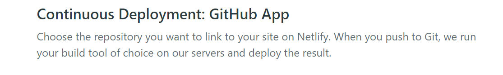

# 01_Deployment

> 2020.11.13 오전 라이브


## 1. Deployment

> "소프트웨어를 사용할 수 있도록 하는 모든 활동"

- 개발을 마무리하고 배포를 해야 제품을 출시 및 운영 할 수 있다.
- 배포를 하게 되면 내 컴퓨터 뿐만 아니라 다른 컴퓨터에서도 소프트웨어를 사용할 수 있다.

- 배포를 하기 전에 테스트를 하고 배포를 하며 배포된 코드에 추가적인 내용을 반영하고 이를 위한 테스트를 진행하는 통합적인 과정을 "CI(Continuous Integration) / CD(Continuous Delivery/Development)"라고 한다.


## 2. Netlify 

> "정적 페이지를 위한 호스팅 서비스"

- 유사한 다른 서비스도 많이 존재한다.

  - Google Firebase Hosting

    https://firebase.google.com/docs/hosting

  - Github pages

    https://pages.github.com/

  - Gatsby

    https://www.gatsbyjs.com/docs/deploying-and-hosting/

- 각 호스팅 서비스 별로 제공하는 요소의 특징을 살펴보고 한번씩 사용해보자


### 2.1. Drag & Drop 

가장 빠르게 배포를 할 수 있는 방법


1. 프로젝트 내부에서 아래의 명령어 수행 

   - `dist` 폴더 생성 

   ```bash
   $ npm run build
   ```

2. [Netlify](https://www.netlify.com/) 접속

   

2. Github 계정으로 로그인

   

3. Sites 클릭

   

4. `dist` 폴더를 위치에 Drag & Drop 이후에 생성된 URL로 접속

   - 배포 끝

   


### 2.2. Git 연동 

1. 작업한 프로젝트 Github repository 연동

   ```bash
   $ git add .
   $ git commit -m "Initial commit"
   $ git remote add origin {github remote 주소}
   
   $ git push -u origin master
   ```

2. Sites에서 `New site from Git` 클릭 

   

3. Github 클릭

   

4. 배포를 원하는 repository 선택

   

   

5. 아래 세팅 진행 후 Deploy site 눌러서 클릭 

   - 배포 완료

   

   6. 추가 수정 사항 반영

      - 연동한 github 레포의 내용을 수정한다.

      - 아래와 같은 명령어로 github 레포에 새로운 내용을 반영한다.

        ```bash
        $ git add .
        $ git commit -m "Edit list item style"
        $ git push
        ```

      - 자동으로 Netlify에 새로 빌드한 내용이 반영된다.


### 2.3. (참고) 배포 주소의 이름 변경

1. 배포된 프로젝트의 환경 설정 클릭

   


2. 원하는 이름으로 변경

   