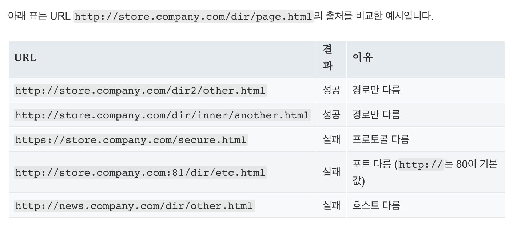
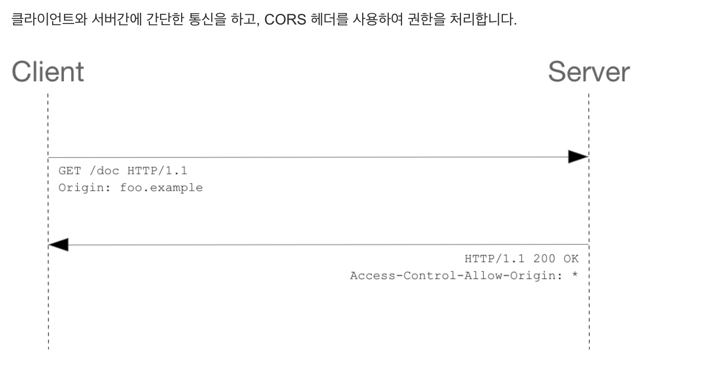
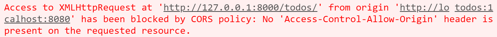

# 01_CORS(Cross-Origin Resource Sharing)

> 2020.11.16 오전 라이브

[강의 코드](https://lab.ssafy.com/ssafy4/vue/tree/master/03_server_client)


## 1. SOP & CORS

### 1.1. SOP(Same-Origin Policy)

> "동일 출처 정책은 **어떤 출처**에서 불러온 문서나 스크립트가 다른 출처에서 가져온 리소스와 **상호작용하는 것을 제한**하는 중요한 보안 방식입니다. 즉, 같은 출처에서만 리소스를 공유할 수 있는 정책을 의미합니다."


- 기본적으로 브라우저를 보호하기 위한 정책
  - 요청에 대한 응답으로 받는 자원에 대한 최소한의 검증을 하는 작업이다.
  - 서버는 정상적으로 응답하지만 브라우저에서 해당 응답을 받지 않는다.

- 출처는 URL을 프로토콜, 포트, 그리고 호스트가 모두 같은 경우를 동일한 출처(Origin)라고 한다.

  


### 1.2. CORS(Cross-Origin Resource Sharing) Policy

> "교차 출처 자원 공유 정책은 HTTP Header를 활용해서 한 출처에서 실행 중인 웹 어플리케이션이 다른 출처의 선택한 자원에 접근할 수 있는 권한을 부여하도록 브라우저에 알려주는 체제를 의미한다."


- CORS Policy는 SOP의 예외 사항
- SOP 체계 속에서 CORS Policy를 지킨 경우에 한하여 다른 출처 간의 리소스 공유가 가능 하도록 설정




### 1.3. CORS Flow

1. Client(Browser) -> Server

   - Request Header에 Origin 필드에 현재 origin에 대한 정보를 넣어 서버로 요청한다.

   ```
   Origin: https://lab.ssafy.com
   ```

2. Server -> Client(Browser)

   - Server는 이 요청에 대한 응답에 access를 위하여 Response Header에 아래와 같은 정보를 채워서 응답한다.
   - 이때 wild card(`*`)를 사용하면 모든 Origin에 대한 허용을 의미한다.

   ```
   Access-Control-Allow-Origin: https://lab.ssafy.com
   ```

3. Client(Browser)
   - Server로부터 응답을 받은 브라우저는 Response Header의 `Access-Control-Allow-Origin`에 Origin에 대한 정보가 있는지 여부를 확인한다.


### 1.4. CORS with HTTP requests & responses

https://fetch.spec.whatwg.org/#http-cors-protocol

- whatwg에 작성된 CORS 관련 내용을 추가적으로 읽어보면서 정확하게 CORS가 무엇이고 어떻게 동작하는지 확인 해보세요.

- 요청을 보낼 때 어떤 일이 일어나고 Server에서 응답을 줄 때 우리가 배웠던 내용 외에 어떠한 추가적인 요소를 더할 수 있는지도 확인 해보세요.

- 스스로 학습의 필요성을 느끼며 찾아가는 과정은 여러 분들이 개발자로서 성장하는 큰 자양분이 될 것입니다.


## 2. 코드의 흐름

- 코드를 작성하는 흐름(방법, 방식)에는 정답이 없습니다.
- 중요한 건 코드를 작성할 때 어떤 생각으로 지금 이 코드를 작성하는지 끊임없이 스스로에게 되묻는 것입니다.
- 그리고 완성된 코드를 다른 사람들과 공유하며 의견을 나눠보세요. 고민하며 토론하는 과정 속에서 여러 분들은 끊임없이 성장 할 것입니다.

- 아래의 흐름을 통해 지난 시간을 복기하며 여러 분들이라면 코드를 어떻게 작성할 지 같이 고민하며 읽어주세요. 완성된 코드는 gitlab에서 확인 하시면 됩니다. 😁


1. Server & Client 환경 세팅
   - 기본적인 가상 환경 세팅 및 마이그레이션 작업 확인

2. Server

   아래의 요소가 어떠한 형태로 구성 되어있는지 확인하고 Postman을 활용해 테스트

   - Model

     - completed 필드는 todo 생성 시 미완료 상태로 두기 위해 `False` 설정

    ```python
    class Todo(models.Model):
        title = models.CharField(max_length=50)
        # completed는 default 속성으로 설정
        completed = models.BooleanField(default=False)
    ```

   - Serializer

     - Serializer의 역할은 QuerySet & Model Instance를 JSON과 같은 포맷으로 변환하기 위함

    ```python
    class TodoSerializer(serializers.ModelSerializer):

        class Meta:
          model = Todo
          fields = ('id', 'title', 'completed',)
    ```

   - View

     - 하나의 url로 GET과 POST 요청을 모두 처리

     ```python
     # 조회 & 생성
     @api_view(['GET', 'POST'])
     def todo_list_create(request):
         if request.method == 'GET':
             todos = Todo.objects.all()
             serializer = TodoSerializer(todos, many=True)
             return Response(serializer.data)
         else:
             serializer = TodoSerializer(data=request.data)
             if serializer.is_valid(raise_exception=True):
                 serializer.save()
                 return Response(serializer.data, status=status.HTTP_201_CREATED)

     # 수정 & 삭제
     @api_view(['PUT', 'DELETE'])
     def todo_update_delete(request, todo_pk):
         todo = get_object_or_404(Todo, pk=todo_pk)
         if request.method == 'PUT':
             serializer = TodoSerializer(todo, data=request.data)
             if serializer.is_valid(raise_exception=True):
                 serializer.save()
                 return Response(serializer.data)
         else:
             todo.delete()
             return Response({ 'id': todo_pk })
     ```

3. Client - Todo Read

   - Todo를 가져올 때 발생하는 CORS Policy 정책 위반 메시지 확인

     

   - [`django-cors-headers`](https://github.com/adamchainz/django-cors-headers)를 활용하여 해결

   - Button -> Created Hook

     - 버튼을 통해 Todo를 가져오는 것이 아니라 Vue의 생명 주기 속에서 특정한 순간에 해야 하는 일을 지정하는 Life Cycle Hook을 활용한다.

4. Client - Todo Create

   - Todo 생성을 위한 로직 작성

   - 지난 수업과 다르게 데이터를 Django Server에 저장한다.
     - `title` 필드만 만들어서 전달하는 건 서버에서 completed의 값을 자동으로 false로 설정하여 저장
   - Todo Create 단계에서 `todos` 배열을 업데이트 하지 않아도 되는 건 `TodoList` 컴포넌트로 이동할 때 Created Hook에 의해 Server로부터 갱신된 todo 목록을 다시 받기 때문이다.
     - Todo를 생성하고 `TodoList` 컴포넌트로 이동


5. Client - Todo Delete

   - 금요일에 진행한 내용과 로직이 다른 이유는 고유한 값의 존재 여부(id)

   ```javascript
   deleteTodo: function (todo) {
     axios.delete(`http://127.0.0.1:8000/todos/${todo.id}/`)
       .then((res) => {
       //1. findIndex로 응답받은 아이디와 일치하는 요소의 index를 찾는다.
       const targetTodoIdx = this.todos.findIndex((todo) => {
         return todo.id === res.data.id
       })
       //2. 기존 배열에서 (위에서 선택한) 인덱스부터 1개를 잘라낸 새로운 배열로 만든다.
       this.todos.splice(targetTodoIdx, 1)
     })
       .catch((err) => {
       console.log(err)
     })
   },
   ```

6. Client - Todo Update

   - Server의 DB에 반영된 todo의 업데이트 상황을 현재 우리가 보고 있는 화면에도 반영

   ```javascript
   updateTodoStatus: function (todo) {
     const todoItem = {
       ...todo,
       completed: !todo.completed
     }
     axios.put(`http://127.0.0.1:8000/todos/${todo.id}/`, todoItem)
       .then(() => {
       // todo의 값을 토글해서 우리가 보는 화면도 반영해주자
       todo.completed = !todo.completed
     })
     ...
   ```

7. 공통 요소 환경 변수 처리

   - 환경 변수 설정 이후에 서버 종료 후 재시작 필수

   ```javascript
   // .env.local

   VUE_APP_SERVER_URL=http://127.0.0.1:8000
   ```

   ```javascript
   // CreateTodo.vue & TodosList.vue 모두 변경

   const SERVER_URL = process.env.VUE_APP_SERVER_URL

   methods: {
   createTodo: function () {
     ...

     axios.post(`${SERVER_URL}/todos/`, todoItem)
       ...
   }
   ```

8. 참고
   - Vue Router를 활용 했을 때 Network Tab를 통해 Reload가 발생하는지 확인해보자
   - 변화가 없다는 것은 우리는 Server로부터 받은 1장의 비어있는 문서에서 모든 것을 처리한다는 말


## 참고 자료

위 자료에 활용한 이미지 등은 모두 아래에 작성된 출처에 기반하였습니다.

| 문서 제목                                                    | 비고      |
| ------------------------------------------------------------ | --------- |
| [교차 출처 리소스 공유 (CORS)](https://developer.mozilla.org/ko/docs/Web/HTTP/CORS) | MDN       |
| [Cross-Origin Resource Sharing](https://web.dev/cross-origin-resource-sharing/) | web.dev   |
| [Cross-Origin Resource Sharing](https://en.wikipedia.org/wiki/Cross-origin_resource_sharing) | Wikipedia |
| [CORS protocol](https://fetch.spec.whatwg.org/#http-cors-protocol) | whatwg    |
| [동일 출처 정책](https://developer.mozilla.org/ko/docs/Web/Security/Same-origin_policy) | MDN       |

